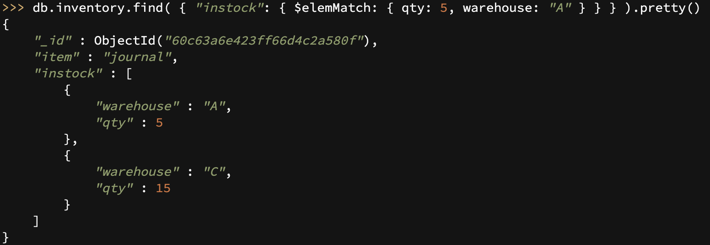

# BasicConcept


**文档数据库**

MongoDB 是一个基于文档的，通用分布式数据库。

基于文档可以理解成mongo是用来存对象的(BSON)，不同于关系型数据库(行列数据库)，将数据存储在类似于JSON的文档中，对象建好数据库就建好了，完全的面向对象编程；

C++ 语言编写。旨在为 WEB 应用提供可扩展的高性能数据存储解决方案。

**MongoDB适合存储一些关系简单、数据量又很大的数据**


**与关系型数据库相比**

* 文档型数据库，灵活性与可伸缩性；
* Map/reduce进行批量处理和聚合操作，Map函数调用emit(key,value)遍历集合中所有的记录，将key与value传给Reduce函数进行处理。
* 弱一致性，表现在锁
* 分布式文件存储(内置GridFS，支持大容量的存储)
* 性能上，查询非索引字段时，比MySQL要好的多
* 删除记录不释放空间，可以定期运行db.repairDatabase()来整理记录，但这个过程会比较缓慢
* 支持复制集、主备、互为主备、自动分片等特性，保证数据的安全性和高可用性


**与redis相比**

* 查询与索引方式灵活，是最像SQL的Nosql


**SQL与NoSQL：**

1. 存储类型：不同于mysql的表格类型，NoSQL主要类型是文档，键值，宽列和图形。它们提供了灵活的模式，并且可以轻松处理大量数据和高用户负载的扩展。
2. 数据模型：NoSQL数据库中的建模关系数据比SQL数据库中的建模关系数据更容易，***因为不必在表之间拆分相关数据*** ；NoSQL数据模型允许将相关数据嵌套在单个数据结构中，可以给任何字段添加索引。
3. 技术发展：随着存储成本的急剧下降，SQL仅出于减少数据重复的目的而创建复杂，难以管理的数据模型的日子已经一去不复返了，开发人员（而不是存储人员）已成为软件开发的主要成本，设计ER图等反锁，也不灵活，不利于快速开发，因此NoSQL数据库针对开发人员的生产力进行了优化。


# 基本操作


## 数据库

| 方法              | 描述                              |
| ----------------- | --------------------------------- |
| show dbs          | 显示所有数据库，没有数据的会i显示 |
| use DATABASE_NAME | 切换数据库/创建数据库             |
| db                | 显示当前数据库                    |
| db.dropDatebase() | 删除数据库                        |

默认存在的数据库：

* admin：这是"root"数据库，将用户添加到这个数据库，会自动继承所有数据库的权限，
* config：用于保存分片的相关信息
* local：主要存储副本集的元数据，即local数据库里的内容不会同步到副本集里其他节点上去
* test：当没有创建数据库时，默认使用的就是test


## 集合


可以看成MySQL中的数据表，只不过集合中存的是JSON


**创建集合**

* db.createCollection(name, options)

* 当插入第一条数据的时候会自动创建集合


options

* capped 是否固定大小，要与size连用
* size 指定集合大小，即字节数，***capped为true时，必须指定size才***
* max 最大文件数，capped为true时才能使用

固定大小为true，插入数据时，MongoDB 首先检查固定集合的 size 字段，然后检查 max 字段

固定大小的集合，有很高的性能以及队列过期的特性(过期按照插入的顺序)，适合类似记录日志的功能(当达到最大值时，它会自动覆盖最早的文档)，固定大小按照文档的插入顺序确定插入位置，确保所有文档在磁盘上的位置一直保持不变。

​		可以添加和更新，但是不能删除，因为要保证位置不变，可以使用 drop() 方法删除 collection 所有的行，还需要再显式的重新创建这个 collection。

​		更新后超过原来的位置时会失败。

eg. 创建一个最多100000字节的集合

```makefile
db.createCollection("mycoll", {capped:true, size:100000})
```

eg.创建一个最多10个文档的集合

```makefile
db.createCollection("top10",{capped:true,max:10})
```


**删除集合**

db.集合名.drop()


**查看当前数据库所有集合**

show tables/collections


# ？

| 集合命名空间             | 描述                                      |
| :----------------------- | :---------------------------------------- |
| dbname.system.namespaces | 列出所有名字空间。                        |
| dbname.system.indexes    | 列出所有索引。                            |
| dbname.system.profile    | 包含数据库概要(profile)信息。             |
| dbname.system.users      | 列出所有可访问数据库的用户。              |
| dbname.local.sources     | 包含复制对端（slave）的服务器信息和状态。 |


## 文档

文档用BSON存储(二进制的JSON，遍历更高效，Binary JSON 的简称)


| 功能             | 命令                                                         |
| ---------------- | ------------------------------------------------------------ |
| 添加文档         | insert和save，。主键已经存在时insert会抛异常，save会进行更新操作 |
| 主键存在时更新   | db.collection.insertOne() 或 db.collection.replaceOne()代替save |
| 添加多个文档     | insertMany                                                   |
| 查询文档         | db.col.find({条件}).pretty()                                 |
| 查询条件的and/or | {}中，隔开的是and的关系，$or:[条件...]是or                   |
| 分页查询         | limit与skip                                                  |
| 排序             | db.COLLECTION_NAME.find().sort({KEY:1})  1是正序             |


## 索引


## 聚合


查看详情不再按照任务聚合，直接分页展示给该账户推送过的全部人员

参考文档：http://wiki.baidu.com/pages/viewpage.action?pageId=1534119114


# Mongo shell  CRUD


## query

测试数据

```shell
db.inventory.insertMany([
   { item: "journal", qty: 25, size: { h: 14, w: 21, uom: "cm" }, status: "A" },
   { item: "notebook", qty: 50, size: { h: 8.5, w: 11, uom: "in" }, status: "A" },
   { item: "paper", qty: 100, size: { h: 8.5, w: 11, uom: "in" }, status: "D" },
   { item: "planner", qty: 75, size: { h: 22.85, w: 30, uom: "cm" }, status: "D" },
   { item: "postcard", qty: 45, size: { h: 10, w: 15.25, uom: "cm" }, status: "A" }
]);
```


**Specify Equality Condition**

指定一个等值的条件`{ <field1>: <value1>, ... }`

查找item为"journal"的文档

```bash
db.inventory.find( {item:"journal"} ).pretty()
```


**Specify Conditions Using Query Operators**

使用mongo的操作符来指定一个条件`{ <field1>: { <operator1>: <value1> }, ... }`

```
db.inventory.find( { status: { $in: [ "A", "D" ] } } )
```

其他操作符


同样是或的意思，当是同一个字段时，可以使用in

```
Although you can express this query using the $or operator, use the $in operator rather than the $or operator when performing equality checks on the same field.
```


**Specify AND Conditions**

同一个{}中的条件的关系都是and，需要同时满足


**Specify OR Conditions**

需要通过$or来指明

```shell
db.inventory.find( { $or: [ { status: "A" }, { qty: { $lt: 30 } } ] } )
```


**Specify AND as well as OR Conditions**

也就是说{}里面可以有$or.$or里面也可以有{}，可以相互嵌套

```
db.inventory.find( {
     status: "A",
     $or: [ { qty: { $lt: 30 } }, { item: /^p/ } ]
} )
```


## Query on Embedded/Nested


**匹配嵌套的文档**

查询size对应的文档是`{ h: 14, w: 21, uom: "cm" }`的文档，并且必须全部匹配且顺序一致

```shell
db.inventory.find( { size: { h: 14, w: 21, uom: "cm" } } )
```


**匹配嵌套的字段**

通过.来匹配嵌套的字段，与非内嵌的用法相同

```shell
db.inventory.find( { "size.uom": "in" } )
```


## Query an Array


查找tags字段对应的数组是`["red", "blank"]`的(且顺序一致)

```shell
db.inventory.find( { tags: ["red", "blank"] } )
```

不要求顺序

```shell
db.inventory.find( { tags: { $all: ["red", "blank"] } } )
```


查找一个数组中是否包含某个字段(存储的文档中tags对应的是一个数组)。对应值是数组的字段，指定的条件的含义是数组中**至少有一个元素**满足查询条件。

即，当一个字段的值是一个数组时，指定的查询条件不是这个字段怎么样怎么用，而是对应数组中至少有一个元素怎么样怎么样。


查询tags对应的数组中**至少有一个元**素等于"red"

```shell
db.inventory.find( { tags: "red" } )
```


dim_cm对应数组中，**至少有一个元素**的值大于25

```shell
db.inventory.find( { dim_cm: { $gt: 25 } } )
```


也可用通过`.`来指定数组中哪一个元素来匹配条件


查询数组中第二个元素大于25的

```
db.inventory.find( { "dim_cm.1": { $gt: 25 } } )
```


用数组的长度组成条件

```
db.inventory.find( { "tags": { $size: 3 } } )
```


## Document Nested in an Array 

数组中内嵌文档的情况

测试数据

```shell
db.inventory.insertMany( [
   { item: "journal", instock: [ { warehouse: "A", qty: 5 }, { warehouse: "C", qty: 15 } ] },
   { item: "notebook", instock: [ { warehouse: "C", qty: 5 } ] },
   { item: "paper", instock: [ { warehouse: "A", qty: 60 }, { warehouse: "B", qty: 15 } ] },
   { item: "planner", instock: [ { warehouse: "A", qty: 40 }, { warehouse: "B", qty: 5 } ] },
   { item: "postcard", instock: [ { warehouse: "B", qty: 15 }, { warehouse: "C", qty: 35 } ] }
]);
```


instock数组中有一个元素是{ warehouse: "A", qty: 5 }的(包括顺序)

```shell
db.inventory.find( { "instock": { warehouse: "A", qty: 5 } } )
```


查找条件是数组元素中某个字段，通过`数字字段名称.元素的某个字段名`

```
db.inventory.find( { 'instock.qty': { $lte: 20 } } )
```


**用数组下标指定元素**也可以指定某个元素的字段

```
db.inventory.find( { 'instock.0.qty': { $lte: 20 } } )
```


**指定多个条件**

指定多个条件(AND关系)，在元素是对象时不能在使用{}了，使用{}组合成的多个条件的含义是or


而要想多个条件之间是and的关系需要借助**$elemMatch**



为什么数组的元素是对象是会不一样？


## Project Fields to Return from Query 


To limit the amount of data that MongoDB sends to applications, you can include a projection document to specify or restrict fields to return.


只返回item和status，1表示需要返回，_id默认也返回，可以将id置为0来去掉id

```
db.inventory.find( { status: "A" }, { item: 1, status: 1 } )
```


除了item和status都返回

```
db.inventory.find( { status: "A" }, { item: 0, status: 0 } )
```


只返回内嵌文档中的**特定字段**:通过`.`指定


只返回数组中嵌入的文档中**特定元素**

```
db.inventory.find( { status: "A" }, { item: 1, status: 1, instock: { $slice: -1 } } )
```


## Update


更新不存在的字段，一些跟新操作会创建这个字段


**updateOne**

用来更新符合条件的第一个

```
db.inventory.updateOne(
   { 查询条件 },
   { 更新操作 }
)
```


