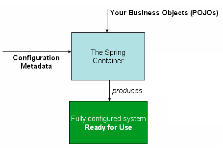

* dependency injection
* events
* resources
* i18n
* validation
* data binding
* type conversion
* SpEL
* AOP
* scheduling
* cache


# IoC

* Inversion of Control

* IoC is also known as dependency injection (DI)


**控制反转与依赖注入的关系**

通过构造方法，或者setter方法等定义好创建对象时的所有依赖，然后当容器创建这个对象时，就按照需求注入所需的依赖。


一个对象可能要依赖多个对象(即对象里的属性的类型是其他class)，当创建这个对象时就要先创建好该对象所依赖的几个对象。



通过使用IoC，来获得对象就可以减少代码量。通过我们配置好的依赖(XML，基于Java注解配置等)和Class，容器帮我们取管理对象。

配置文件中通常由多个bean组成，XML中是`<beans/>`里多个`<bean/>`元素，Java configuration 通常是@configuration 类有多个@bean 注释的方法。


基于XML

```xml
<?xml version="1.0" encoding="UTF-8"?>
<beans xmlns="http://www.springframework.org/schema/beans"
    xmlns:xsi="http://www.w3.org/2001/XMLSchema-instance"
    xsi:schemaLocation="http://www.springframework.org/schema/beans
        https://www.springframework.org/schema/beans/spring-beans.xsd">
  <!--可以引入其他配置文件-->
   <import resource="services.xml"/>
    <import resource="resources/messageSource.xml"/>
    <import resource="/resources/themeSource.xml"/>

    <!-- services -->

    <bean id="petStore" class="org.springframework.samples.jpetstore.services.PetStoreServiceImpl">
        <property name="accountDao" ref="accountDao"/>
        <property name="itemDao" ref="itemDao"/>
        <!-- additional collaborators and configuration for this bean go here -->
    </bean>

    <!-- more bean definitions for services go here -->

</beans>
```


# 容器

ApplicationContext 接口代表 Spring IoC 容器，负责实例化、配置和装配 bean。通常创建 ClassPathXmlApplicationContext 或 FileSystemXmlApplicationContext 的实例。

容器通过读取配置元数据获取关于实例化、配置和组装什么对象的指令。配置元数据用 XML、 Java 注释或 Java 代码表示。


**实例化容器**

就是将配置文件的路径告诉容器

```
ApplicationContext context = new ClassPathXmlApplicationContext("services.xml", "daos.xml");
```


**使用容器**

```java
// retrieve configured instance
PetStoreService service = context.getBean("petStore", PetStoreService.class);

// use configured instance
List<String> userList = service.getUsernameList();
```


