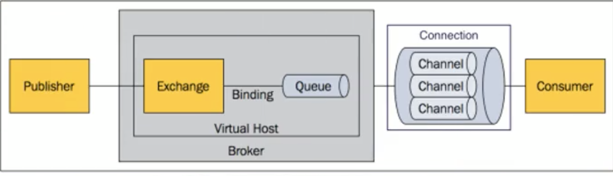

# Basic

* 干什么，怎么用
* 常见的问题


摘要：

* 定义与用途
* 组件的作用
* 消息处理流程
* 最终一致性,持久化，传输确认，发布确认
* 广播
* 削峰
* 路由
* 集群


## 干什么的

是分布式系统中重要的组件，主要用来应用结构，异步消息，流量削峰等。

使用场景：

* 异步处理，消息发送成功后就返回，消息可以被一个或多个程序读取执行对应的操作
* 应用解耦，生产者和消费者之间没有直接调用，任何一方失败不影响另一方
* 流量削峰，将请求缓存到队列中，防止流量过大
* 日志处理，解决大量日志的传输问题，如kafka


## 什么是消息队列

本质是一个队列，遵循先进先出原则。

生产者生产消息，将消息发送到broker，再发送到目的地。

消息队列有两种目的地：队列和主题


## 名词


**broker**

消息的代理

**destination**

目的地，包含队列和主题两种形式

**queue**

(point-to-point)点对点的消息通信

**topic**

(Publish/subscribe)发布订阅的消息通信

**queue与topic的区别**

queue中可以有多个消费者，但是只会被一个消费掉

topic中也可以有多个消费者，但它的所有消费者都能收到消息


# **JMS**

Java MessageServer实际上是指JMS API,包括创建，发送和接收

 JMS提供了两种消息模型，peer-2-peer(点对点)以及publish-subscribe（发布订阅）模型。

 常见的消息队列，大部分都实现了JMS API，可以担任JMS provider的角色，如ActiveMQ，Redis以及RabbitMQ等。

* 实现：ActivityMQ


**消息模型**

在JMS标准中，有两种消息模型：P2P，Publish/Subscribe

P2P:消费者，生产者和队列。一个消息智能被一个消费者消费。如果希望每个消息都被处理成功，应该使用P2P

Pub/Sub：发布者、订阅者和主题。发布者将消息发布到主题，主题将消息传递给订阅者。


**消费消息**

同步：订阅者或消费者通过receive方式来接收消息，没收到消息时一致处于阻塞状态

异步：订阅者或消费者注册监听器，有消息时监听器自动执行响应的方法


# **AMQP**

advanced message queuing protocol


AMQP模型


最早用于解决金融领不同平台之间的消息传递交互问题

AMQP不从API层进行限定，而是直接定义网络交换的数据格式。这使得实现了AMQP的provider天然性就是跨平台的。意味着我们可以使用Java的AMQP provider，同时使用一个python的producer加一个rubby的consumer。

AMQP的生产者并不会直接将消息发布到队列中。AMQP在消息的生产者以及传递信息的队列之间引入了一种间接的机制：Exchange

* 实现：RabbitMQ
* 兼容JMS
* 包括点对点/发布订阅在内，有5种消息模型，与发布订阅差不多，但是路由更细致
* 与JMS不同，消息类型只能序列化成byte[]后再发送，所以可以跨平台跨语言
* 两种Spring都支持，并且提供了JmsTemplate和AmqpTemplate


区别：

AMQP为消息定义了线路层（wire-level protocol）的协议，而JMS所定义的是API规范

AMQP是跨语言跨平台的

JMS 支持TextMessage、MapMessage 等复杂的消息类型；而AMQP 仅支持 byte[] 消息类型（复杂的类型可序列化后发送）

由于Exchange 提供的路由算法，AMQP可以提供多样化的路由方式来传递消息到消息队列，而 JMS 仅支持 队列 和 主题/订阅 方式两种


**常用消息队列对比**

ActiveMQ


***Kafka***

适合高吞吐量的分布式发布订阅MQ，如日志大数据处理


## Rabbit工作原理




即：

消息生产者将消息发送到broker中的一个vhost中的一个Exchange，Exchange通过Binding发送到一个Queue。

消息消费者与消息队列建立一个连接，可以有多个通道，通过通道来获得消息


**Virtue Host**

虚拟主机，简称vhost。

可以在消息队列服务器上划分多个vhost，每个vhost都相当于是一个RabbitMQ服务器，拥有自己的Exchange，Queue等资源，必须在连接是指定，RabbitMQ默认vhost是/(vhost通过路径来划分)

**Broker**

消息代理(消息队列服务器)，就是一个RabbitMQ服务

**Message**

由消息头和消息体组成，消息头时透明的，消息体是不透明的。

消息头由一系列可选属性组成(路由键routing-key，优先级priority，delivery-mode)

消息体是我们自定义

透明：指的是由规范的

**Publish**

消息的生产者，将消息发送给broker中的Exchange

**Exchange**

交换器，决定将收到的消息路由到哪个队列

有4种Exchange：direct，fanout，topic，headers。(后三者是发布订阅模式)

Exchange+Route Key来确定路由规则，消息发送到指定的Exchange后，将消息的route key按照Exchange的模式去匹配Exchange的route key，路由到不同消息队列。

默认Exchange就当成是没有Exchange，直接连接Queue

**Binding**

就是基于路由键将Exchange与Queue连接起来的路由规则。Exchange与Queue可以是多对多的关系，Route Key决定了消息会到哪个消息队列。

**Queue**

消息队列，用来存储消息，一个消息可以保存到一个或多个消息队列中，直到消费者连接到这个队列把消息取走。一个队列亦可以设置成有一个或多个消费者消费

**Consumer**

从消息队列取消息的程序

**Chanel**

每一次来取消息都建立一个TCP连接是非常消耗资源的，所以它会在**一个连接中建立多个信道**。即建立一个连接，可以有多个发消息的通道。

信道是用来节省资源


## 运行机制


核心就是路由的机制

Exchange通过路由键和binding将消息派发到队列


## **Exchange 的路由算法**


- Direct：如果 消息的routing key 与 binding的routing key 相同的，消息将会路由到该队列上；典型的点对点消息模型
- Topic：如果 消息的routing key 与 binding的routing key 符合通配符匹配的话，消息将会路由到该队列上；*匹配一个字符，#匹配一个或多个
- Headers：如果 消息参数表中的头信息和值 都与 bingding参数表中 相匹配，消息将会路由到该队列上；用的少
- Fanout：广播，不管消息的routing key和参数表的头信息/值是什么，消息将会路由到所有队列上。

在发送消息时，往往要指定Exchange和一个routingKey,Exchange将路由到绑定的query上


Message Queue

多用于分布式系统之间的通信，实现MQ的两种主流方式：AMQP、JMS。

* JMS限定了必须使用Java语言；AMQP只是协议，不规定实现方式
* JMS规定了两种**消息模型**；而AMQP的消息模型更加丰富


RabbitMQ：基于AMQP协议

ActiveMQ：基于JMS

RocketMQ：基于JMS

Kafka：分布式消息系统


劣势

* 系统可用性降低
* 系统复杂度提高
* 一致性问题


死信队列

延时队列

发布确认

幂等性

优先级队列

惰性队列


## 六大模式

### **1. 简单模式**

消息生产者将消息放入消息队列，消费者监听队列，消费消息


### **2. 工作模式(竞争消息)**

又称任务队列，一个队列可以有多个消费者，轮询消费消息。

**消息应答**

消费者在消费完消息后需要通知MQ，MQ才会将这条消息删除掉

高吞吐量or数据安全

**自动应答**：发送后就认为成功了，就删除消息

**手动应答**：批量应答(不要用)，创建的队列不自动删除消息

**消息的自动重新入队**

消息没应答，就重新入队

**队列持久化**

**消息持久化**：生产者发送消息时需要指明这条消息是需要持久化的

**不公平分发**: 消费者设置信道Qos

**预取值**(prefetch)：指定消费者能分到的消息的数量


### 4 发布确认

设置队列必须持久化，设置队列中的消息也必须持久化，即使做到了这两条，也有可能发送的消息持久化失败等问题，所以需要发布确认。

Rabbit持久化完消息后回复生产者

1. 开启发布确认方法
2. 单个确认发布/批量确认发布/异步确认发布

**单个的同步确认**

只有收到确认后，才会发送第二条消息

**批量确认**

当出现问题时不知道是哪个消息的问题

**异步确认**

通过回调函数来通知你消息的状态


**发布订阅模式(共享消息)**

每个消费者拥有一个自己的队列


**路由模式**

多了routingKey


**主题模式**

另一种路由方式，通配符routingKey


**发布确认模式**


# 使用：


RabbitMQ由Erlang语言开发，需要安装与RabbitMQ版本对应的Erlang语言环境。


## Docker安装RabbitMQ

1. 获得镜像。选择带management标签的(带web界面)
2. 运行。两个端口映射：5672 是主机端口，15672是web页面端口
3. 默认账号和密码是guest，可以在运行的时候通过-e设置，或者在管理界面添加
4. 可以在web管理界面创建vhost，Exchange，Queue，发送接收消息


```
docker run -d --hostname my-rabbit --name rabbit -p 15672:15672 -p 5672:5672 rabbitmq:management
```


查看SpringAMQP


## 集群


负载均衡


？

**消息的丢失和重复消费**

队列及消息的持久化

发布确认及消息应答