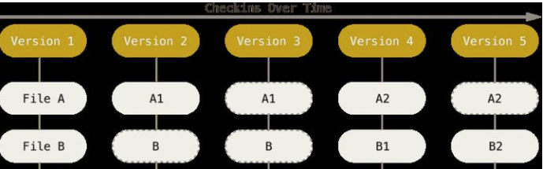

* HEAD
* git工作流
* 远程跟踪分支
* 标签的作用
* 移动head与移动提交记录
* git branch -f /rebase中，head怎么变了


git checkout HEAD^2用来改变git checkout HEAD~n的路径

# Basic Concept


**版本控制**

主要功能是用来记录多人对文件的修改历史，以方便进行恢复备份等


**集中式版本控制**

版本库是集中存放在中央服务器的，而在开发的时候，先要从中央服务器取得最新的版本，然后开始开发，开发完成后，再把自己的改动推送给中央服务器。弊端就是本地不保存全部文件，需要联网从远程仓库获得。


**分布式版本控制**

本地保存着完整的文件，同样有一个远程仓库，都通过远程仓库来推送修改或获得他人的修改


**快照**

git采用快照来保存信息，但不是每个版本都保存全部的快照，对与哪些没有做出修改的文件，只是记录了它的一个引用。



Version的A1只保存Version2中的A1的引用


**工作区(树)**

Working tree。对文件进行修改就进入了工作区


**暂存区**

Staging area，索引(Index)是暂存区的另一种说法。通过git add 将工作区的修改保存到暂存区。暂存区用来保存这次需要提交的文件列表信息。


**本地仓库**

安全存放数据的位置，这里面有提交的所有版本(快照)。其中HEAD指向最新放入仓库的版本。


**远程仓库**

代码托管的服务器(比如github)


# 本地git的操作


## git配置


**查看当前的配置**

```bash
git config -l
```


**添加配置项**

```bash
git config [--global] key value
```


**添加配置项**

```bash
git config [--global] --unset key
```


**设置签名(user.name和email)**

代码托管中心(比如git)账户名的用户名和本地的签名没有关系

签名的用户名和邮箱之间也不是要关联的，签名只是用户的表示，每次提交都会用到签名

配置分两种：**全局的和项目级别的**

项目级别的签名：仅当前仓库有效

全局的签名:加--global表示全局

```
git config [--global] user.name [name]
git config [--global] user.emali [email]
```


## 本地库三个空间的交互


常用命令

| 命令       | 描述                           |
| ---------- | ------------------------------ |
| git status | 查看当前状态(分支，工作区间等) |
|            |                                |
|            |                                |


1. 工作区

| 操作               | 命令           |
| ------------------ | -------------- |
| 工作区添加到暂存区 | git add        |
| 撤销暂存           | git reset HEAD |
| 查看工作区的修改   | git diff       |
| 放弃工作区的修改   | git checkout   |
|                    |                |


2. 暂存区

| 操作                                   | 命令             |
| -------------------------------------- | ---------------- |
| 暂存区提交的本地库                     | git commit -m    |
| 撤销提交，回到暂存区(即本地库后退一步) | git reset --soft |


3. 本地库

| 操作                         | 命令              |
| ---------------------------- | ----------------- |
| 本地库直接提交(已经追踪的)   | git commit -am    |
| 本地仓库和暂存区回到某个版本 | git reset --mixed |
| 三个区回到某个版本，         | git reset --hard  |


## git log

| 命令                       | 参数                                 |
| -------------------------- | ------------------------------------ |
| git log                    | 显示log完整信息                      |
| git log --pretty=oneline   | 显示简略信息                         |
| git log --oneline          | 显示简略信息(md5缩写)                |
| Git reflog                 | 比git log --online多HEAD移动的步数   |
| git log --graph            | 显示分支的图像                       |
| git log --stat             | 显示每次提交的增删量                 |
| git shortly                | 会按照作者分组，查看每个人的提交历史 |
| git log --author="John"    | 按作者查看提交记录                   |
| git log -- 文件            | 查看某个文件的提交记录               |
| 空格下翻页，b上翻页，q退出 |                                      |


## **版本的前进与后退**

本质是操作HEAD指针在提交记录上移动

* 使用索引值(推荐)
* 使用HEAD^(只能后退)
* 使用HEAD~(只能后退)

```bash
git reset --head 索引值
# ^退一步 n个^就是推n步
git reset --hard HEAD^
# 后退n步
get reset --hard HEAD~n
```

**hard,soft,mixed的区别**

soft只移动指针(本地库后退)

mixed重置暂存区(本地库和暂存区后退)

hard重置暂存区和工作区(本地库暂存区公工作区后退)

***checkout用来改变HEAD的位置***

**分离的HEAD**

就是HEAD指向了某个具体的提交记录而不是分支名。

## 分支

创建多个分支同时推进多个任务

一般不在master上开发，而是创建一个分支开发完功能或修完bug后合并到master。

| 操作                                         | 命令                                                 |
| -------------------------------------------- | ---------------------------------------------------- |
| 切换分支                                     | git checkout 分支名                                  |
| 查看当前本地分支                             | git status/gitbranch                                 |
| 查看远程分支                                 | git branch -r                                        |
| 创建分支                                     | git branch 分支名/git checkout -b 分支名(创建并切换) |
| 在指定位置创建分支                           | git branch 分支名 位置                               |
| 合并分支(将别的分支合并到当前分支，注意方向) | git merge 哪个分支要合并进来                         |
| 删除分支                                     | git branch -d 分支名                                 |

**分支**

新建一个分支实际就是新建了一个指针，然后HEAD指向这个指针，下次提交就在HEAD指定的这个分支进行提交。所以创建再多分的支也不会造成储存或内存上的开销。

**远程分支**

远程跟踪分支看成是一个代表远程仓库的分支，**push就是将当前分支合并到远程跟踪分支**，所以在远程仓库发生变化的时候(会更新远程跟踪分支，相当于两个分支同时修改)，就可能会导致冲突。或者**pull就是将远程跟踪分支合并到本次分支**，远程仓库发生变化(就相当于远程跟踪分支对文件进行了修改)导致与本地分支冲突

**产生冲突的原因以及如何避免冲突**

产生冲突的原因：两个分支在相同基础上对同一个文件的同一个位置进行修改，并且修改的内容不一致

相同基础：相同的初始状态，即两人开始开发时的文件都是相同的，一种情况是master创建了一个分支dev，两个分支现在的状态就是相同的，当在这两个分支的同一个文件的同一个位置进行修改，并且修改的内容不一致，进行merge时就会产生冲突。另一种情况，创建完dev后两人同时进行了开发，对同一个文件的同一个位置进行修改，并且修改的内容不一致，当第二个人提交时，远程分支与本地分支就会发生冲突，这种情况就需要先合并远程分支再push。

**避免冲突**

这里主要是避免远程仓库的冲突。假设需要在dev分支进行开发

1. 不直接在dev上进行开发，而是创建一个本地分支，在本地分支上进行修改和提交本地仓库
2. 及时跟新dev分支上的代码，尤其是需要将代码提交到远程仓库前
3. 提交前dev已经是最新代码了，所以将本地分支合并如dev，有冲突在本地解决冲突
4. 将dev提交到远程分支

**冲突合并**

```
<<<<<<HEAD	
xxxxxx(当前分支的内容)
======			
yyyyy(另一个分支的内容)
>>>>>> 
```

就是吧<<<……>>>中间的内容给合并了(此时的状态是有冲突)，然后git add来标志已经解决冲突了(此时标记冲突解决，处于合并状态)，再commit完成合并。

**merge的含义**

dev合并到master

1. dev包含了master中的全部文件

实际就是master指针前移到dev

2. dev和master都进行了修改，两者都含有一部分


**rebase**

rebse不同于merge的是rebase是把另一个分支的提交记录复制过来，逐个放到当前分支，看起来像是只在这个分支同步开发的一样。rebase 的优势就是可以创造更线性的提交历史,代码库的提交历史就会很清晰。

`git rebase 分支1 分支2`

**merge与rebase**

* 合并的方向是相反的

**让分支指向另一个提交**

```bash
git branch -f 分支名 提交记录
```

**reset与checkout的区别**

reset用来修改提交历史，checkout用来修改head


**git revert**

回滚，远程分支的提交记录是撤销不了的.

`git revert x1`并不是回到x1，而是新建一个提交记录，这个版本与x1相同

**只需要将一个分支的一部分记录合并到另一个分支**

`git cherry-pick 提交记录列表`该命令将会把指定的几个记录添加到HEAD下

**交互式rebase**

```
git rebase -i
```


* 调整记录的顺序
* 删除不想rebase的记录
* 将多个提交合并成一个

有时候我们为了方便在bugFix分支上添加了许多调试方法，而在master上是不能有这些方法的，通过两个方法不提交这些方法

1. `git cherry-pick`
2. `git rebase -i`

## 与远程库的交互

**更新本地仓库**

`git fetch origin 分支名`+`git origi/分支名`

将数据先拉到远程跟踪分支，但是不会改本地分支，需要再将远程分支合并到本地

`git pull` 直接将本地代码跟新

远程跟踪分支只会在`git fetch`或者`git push`时更新，我们无法对远程跟踪分支进行操作，智能切回

**提交到远程仓库**


## 标签

永远指向某个提交记录，比如软件发布新的大版本，或者是修正一些重要的 Bug 或是增加了某些新特性。它们并不会随着新的提交而移动。不能检出到某个标签上面直接进行修改提交，它就像是提交树上的一个锚点，标识了某个特定的位置。

`git tag 标签名 提交历史`

**git describe**

`git describe 提交历史`，用来查找里指定历史记录最近的tag。会返回`标签_中间相隔几个提交_指定记录的Hash`

git bisec


# 远程分支操作

`git clone`

远程分支反应远程仓库(上一次和它通信)时的状态，有助于了解与本地仓库之间的区别。

我们并不能直接commit到远程分支，而是push到远程仓库，然后自动更新远程分支。

`git fetch`

* 下载文件
* 同步远程分支

虽然数据都下载下来了，但不会修改磁盘上的文件，此时本地分支还在原处，不会改变本地仓库的状态，，所以看不到更新。

**远程分支更新后，可以像合并分支一样将本地分支与远程分支合并。**

`git pull`

先下载更新然后合并到本地分支这个流程很常用，所有git将`git fetch`和`git merger`封装成了`git pull`

`git pull --rebase`

将`git fetch`和`git rebase`合并

# git工作流程


## 跨团队协作

fork一个远程仓库当自己的远程仓库，然后进行开发，最后发送一个push request合并到原始的远程仓库